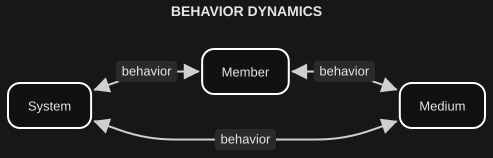

# Behavior Dynamics

*On the rules of the game.*

Identifying the fundamental building blocks of systems analysis is a challenge. We often impose hierarchical structures, but these can conflict with the complexity of systemic interactions. Starting with a model that is too simplistic, or overly complex, creates problems of its own as the analysis develops.

We are going to offer a model labeled **Behavior Dynamics**. It contains one main systemic phenomenon (**Behavior**) and three main systemic entities (**System**, **Member**, **Medium**).

- **BEHAVIOR**: The transformation of a medium by system members.

- **SYSTEM**: An environment where interrelated members express behavior.

- **MEMBER**: A unit that expresses behavior within a system.

- **MEDIUM**: Components of a system transformed by its members to express their behavior.

These four are simultaneous and interrelated. You do not first have a system and then add members to it, or first have a medium and then wait for behavior to appear. The arrangement is an intellectual device for exploring their interaction, not a claim about which one is more real.

The distinction that most often collapses is the one between **system** and **medium**. A garden, as an environment of interrelated members — plants, insects, a gardener — is a system. The soil the gardener works, the water they redirect, the seeds they select: those are medium. Behavior is what happens when members transform that medium. If you treat the soil as if it were the garden, or the garden as if it were a pile of soil, the rest of this framework will not sit still.

Other starting systemic models can be compatible with Conciliatorics, as long as they do not hinder its intentions. We welcome analytical bridges with other models. And if a better starting model is found later — endogenous or by external suggestion — we will adapt it to the rest of the work. We needed a starting framework. This is the one we are using.
