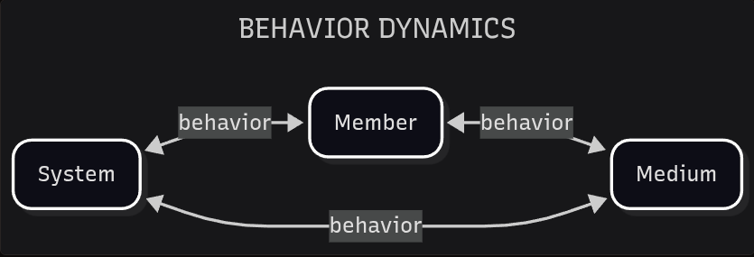

# Behavior Dynamics

*On the rules of the game.*

Identifying the fundamental building blocks of systems analysis is a challenge. We often impose hierarchical structures, but these can conflict with the complexity of systemic interactions. Additionally, starting with a model that is too simplistic or overly complex can create problems as the analysis develops.

We are going to offer a model labeled **Behavior Dynamics**. This model contains one main systemic phenomenon (**Behavior**) and three main systemic entities (**System**, **Member**, **Medium**).

- **BEHAVIOR**: The transformation of a medium by system members.

- **SYSTEM**: An environment where interrelated members express behavior.

- **MEMBER**: A unit that expresses behavior within a system.

- **MEDIUM**: Components of a system transformed by its members to express their behavior.

The existence of the three main entities and the systemic behavior are simultaneous and interrelated. In essence, this analytical arrangement is just an intellectual device to explore their interaction. We will expand on this model in future discussions, as our focus here is Conciliatorics. But we needed a starting framework for the following analysis.

Other starting systemic models similar to Behavior Dynamics can be compatible with Conciliatorics, as long as they do not hinder its intentions. We welcome analytical bridges with other models to enhance Conciliatorics' coverage. And if a better starting model is found on a later date (either endogenous or by external suggestion), we will adapt it to the rest of the work.

