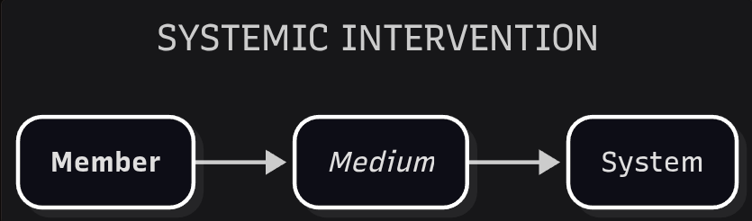
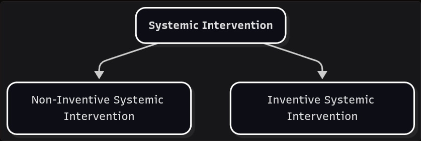
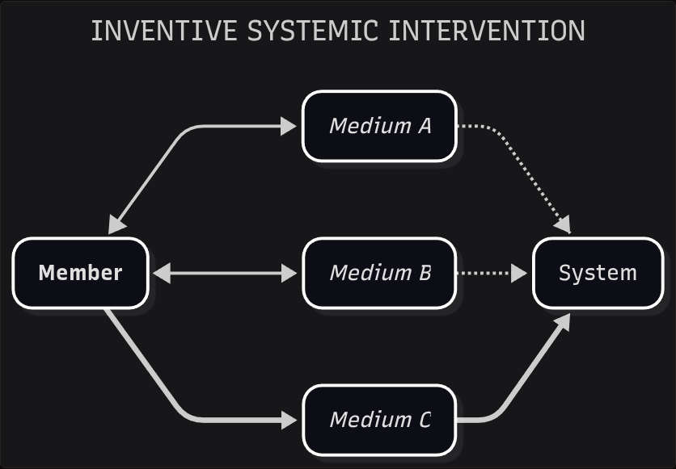

# Systemic Intervention

*On entering the field.*

Behavior Dynamics leads to various types of interactions and configurations. One of them is **Systemic Intervention**. This interaction is explicitly hierarchical and based on the member entity.

- **SYSTEMIC INTERVENTION**: Action performed by a member that seeks to influence the behavior of a system.

- **INTERVENER**: Member that implements systemic intervention in a system.

A member's behavior can be intentional or not, localized or expansive, short-term or planned ahead. Systemic intervention is intentional, expansive, and planned ahead. That behavior designates a member as an **intervener**. The label does not preclude the same member from holding other roles in the same system. Further developments in Behavior Dynamics will introduce additional <plain>interaction</plain> labels.

## Inventive Intervention

Of the different subtypes of systemic intervention, we will narrow our focus to one that will serve as the main foundation of Conciliatorics: **Inventive Systemic Intervention**. For simplicity, we will refer to this subtype as **Inventive Intervention**. For now, any other subtypes will be categorized as **Non-Inventive Systemic Intervention**, so that we do not diverge from our focus.

- **INVENTIVE SYSTEMIC INTERVENTION**: Exploration of a system's medium that seeks to influence its behavior.

Inventive intervention works the medium *before* proceeding to the system's effects. A cook does not influence a meal by instructing the guests; they work the ingredients. A legislator does not influence a polity by wishing it otherwise; they work the text of a statute, the medium through which that influence is supposed to travel. In both cases the intended intervention is enhanced by staying with the medium long enough to change it.

While the medium is transformed toward its desired state, the intervener can also improve their craftsmanship. That feedback runs among all three entities: a better medium, a more capable member, a system whose behavior has somewhere to go. When several interveners enter the same loop, and when that loop stretches across space and time, the behavior that results is highly complex.

To manage inventive intervention at this analytical level, we need a concise yet flexible foundation. We will break that complexity into distinct parcels.
