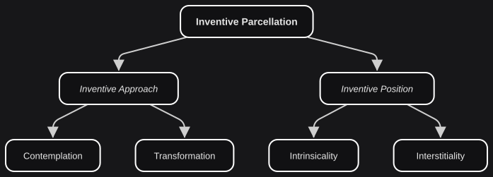

# Inventive Parcellation

*On finding your place.*

There are multiple ways to structure inventive intervention internally. For Conciliatorics, we focus on **Inventive Parcellation**. We respect and welcome alternative structures, but this one is necessary for the current state of Conciliatorics. Any alternative model must integrate with it.

- **INVENTIVE PARCELLATION**: Primary structure of inventive intervention.

- **INVENTIVE APPROACH**: Method of inventive intervention.

- **INVENTIVE POSITION**: Focus of inventive intervention.

These are not autonomous dynamics. Every time an intervener performs inventive intervention, there is a **method and a focus** related to that behavior. Each parcellation places an *emphasis*. The other mandatory elements — behavior, member, medium, system — are still present.

## Approach and position

The next cut is where that emphasis sits.

- **CONTEMPLATION**: Inventive approach with emphasis on the *intervener*. Relates to *knowledge building* and *judgement*.

- **TRANSFORMATION**: Inventive approach with emphasis on the *system*. Relates to *concrete change* and *performance*.

- **INTRINSICALITY**: Inventive position with emphasis on the *intervenable*. Relates to *direct engagement* and *inherent properties*.

- **INTERSTITIALITY**: Inventive position with emphasis on the *systemic*. Relates to *intangible outcomes* and *relational properties*.

Contemplation and Transformation are the more familiar of the two pairs. Their difference is whether the intervener is building knowledge of a given arrangement of Behavior Dynamics, or facilitating a change that reorganizes those elements.

Intrinsicality and Interstitiality need more care, because ordinary language collapses them. Imagine that you have a *ceramic mug*. You grow attached to it, to the point that you call it "your mug". One day you lose that mug, and someone gifts you a *glass mug*. You start using it, but it is not "your mug". **Ceramic** and **glass** are intrinsic: they belong to the materials the mug is made of, and they would still be ceramic and glass if no one ever loved the object. A mug being **yours** is interstitial. It arises from the relation you develop with it over time, and it is not inherent to you or to the mug.

The same cut appears elsewhere. The chemical composition of a river is intrinsic. That the same river is a border between two states is interstitial: nothing in the water is a border.

## Inventive Parcels

An extended analysis of the four elements in isolation may be interesting. In this model they are never isolated, so we move to their configurations.

- **INVENTIVE PARCELS**: Main configurations of inventive parcellation: Intrinsic Contemplation, Intrinsic Transformation, Interstitial Contemplation, and Interstitial Transformation.

| **INVENTIVE PARCELS** | **Intrinsicality** | **Interstitiality** |
|---|---|---|
| **Contemplation** | Intrinsic Contemplation | Interstitial Contemplation |
| **Transformation** | Intrinsic Transformation | Interstitial Transformation |

These four can be small actions or large endeavors. They can be performed by a single intervener or by many, and they can develop in a contained way or over time. They are never, in this model, four unrelated practices. We turn next to the parcels that progress continuously.
