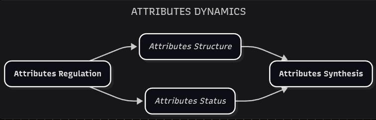

# Attributes Dynamics

*On mapping the unseen.*

Part 1 left us at the parcel with the highest risk of ossification: Edified Interstitial Contemplation, or **EIC**. Its associated field is Philosophy. Its job, inside Conciliatorics, is contemplative work on interstitial qualities of Behavior Dynamics — not a new cosmology, and not a license to start from scratch.

The material of that work is the **Attribute**.

- **ATTRIBUTE**: Specific quality of a system, member or a medium. In this framework, an attribute is not merely a passive trait but a dynamic component that interacts with behavior, structure, and purpose.

Many philosophical frameworks invent a new foundation for every such quality. We already have Behavior Dynamics. That starting model keeps EIC congruent with the other inventive parcels, so that an analytical development here can still be traced back to the same members, medium, and system that the sciences, technology, and the arts also engage.

What we still need is a structure that lets us explore those qualities without the exploration falling apart. We'll label this model **Attributes Dynamics**. It is not to be carelessly altered — any revision must account for its impact on the rest of the conceptual ecosystem.

- **ATTRIBUTES DYNAMICS**: An EIC model designed to promote analytical exploration and integration of attributes.
- **ATTRIBUTES REGULATION**: EIC step that provides the rule set for the attributes structure and status exploration.
- **ATTRIBUTES STRUCTURE**: EIC step that explores the interstitial anatomy components of Behavior Dynamics.
- **ATTRIBUTES STATUS**: EIC step that studies the interstitial physiology processes of Behavior Dynamics.
- **ATTRIBUTES SYNTHESIS**: EIC step that integrates the exploration of attributes structure and status.

Attributes Structure and Attributes Status have the largest <plain>potential</plain> for conceptual exploration and implementation. Attributes Regulation and Attributes Synthesis serve as containers: they keep that exploration congruent within EIC and with the rest of the inventive parcels.

We begin with Attributes Regulation.
