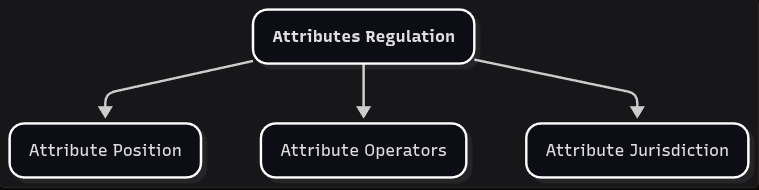

# Attributes Regulation

*On return tickets.*

The essence of inventive edification is to proliferate until a beneficial outcome is reached. That impulse is not a flaw. A contemplative parcel that refuses to generate new distinctions will never have enough material to reconcile anything. The danger is the other side of the same motion: exploration without a way home. Terms multiply, diagrams accumulate, and after a while it is no longer clear whether a new distinction is still inside the framework or has quietly become a private language.

We have already watched this degeneration at the scale of whole parcels. Inventive Ossification is what happens when an edification stops serving Behavior Dynamics and starts demanding that Behavior Dynamics pass through it. Attributes Dynamics can fail in the same way, internally. If EIC is allowed to invent without a rule set, it will reproduce inside itself the unregulated scope we are trying to spare philosophy from.

So we begin the EIC journey with a concrete analytical regulation — not to shrink the exploration, but to keep it from degenerating as it grows.

- **ATTRIBUTES REGULATION**: EIC step that provides the rule set to explore the attributes structure and status.

That rule set has three parts, and they are the three chapters that follow:

- **Attribute Position** — what we are allowed to focus on. Every attribute sits on a position: intrinsic or interstitial. EIC commits to the interstitial side.
- **<plain>Attribute Operators</plain>** — how attributes are allowed to relate. We do not work with isolated qualities. We work with attribute pairs, and with a small set of operators between them.
- **Attribute Jurisdiction** — where a concept is allowed to live. Each pair and each compound occupies a bounded environment.

Together they are the opening anchor of Attributes Dynamics. Attributes Synthesis will be the closing one. Between the two, Attributes Structure and Attributes Status are free to proliferate — that is their job — but they proliferate *inside* this rule set, not around it.

Attributes Regulation may be modified or expanded only if it serves the purpose of Conciliatorics.

We start with Attribute Position.
