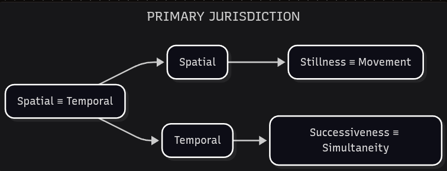

# Attribute Jurisdiction

*On tangled borders.*

The last part of the rule set is the idea that each attribute pair, and each compounded <plain>interaction</plain> of pairs, **must have clear boundaries**. To keep those boundaries in view, we assign **jurisdictions** to Conciliatorics elements.

- **SYSTEMIC JURISDICTION**: The bounded environment that contains Conciliatorics components.

This terminology reaches backward as well as forward. The four inventive parcels each operate within their own *systemic jurisdiction*, whose boundaries are defined by the complementarity between their inventive approach and inventive position. A parcel that forgets those boundaries is already on the way to ossification. We now extend the same discipline to the components of Attributes Dynamics:

- **ATTRIBUTE JURISDICTION**: The bounded environment that contains Attributes Dynamics components.

Inventive ossification tends to erode these boundaries. The proper scope of a parcel, or of a concept inside EIC, begins to overreach into others.

- **JURISDICTIONAL OVERREACH**: The process by which one jurisdiction breaks boundaries to exert control over others.

A finance ministry that starts writing security protocols is overreaching. So is a philosophical framework that starts telling the sciences what their ceramic is allowed to be.

Overreach is not the only way boundaries fail. Healthy jurisdictional boundaries aim for proper **differentiation**. They can also deteriorate by **dissociation** or **dissolution**.

- **JURISDICTIONAL DIFFERENTIATION**: The process and systemic state in which boundaries are properly maintained. The jurisdiction is aware of its distinct role while cultivating healthy <plain>interactions</plain> — this promotes **systemic diplomacy**.
- **JURISDICTIONAL DISSOCIATION**: The process and systemic state in which boundaries fracture. The jurisdiction isolates itself, forming a **systemic silo**.
- **JURISDICTIONAL DISSOLUTION**: The process and systemic state in which boundaries merge. The jurisdiction fuses into others, forming a **systemic amalgam**.

A standards body that will not speak to the engineers who implement the standard has dissociated: the boundary is intact as a wall, and useless as a border. Two offices merged until a decision has no owner have dissolved: there is no longer a jurisdiction to be honest about. A court that knows it is not a legislature, and still has to work with one, is closer to differentiation — a distinct role, in contact.

With that framework in place, we can name a starting environment for the next EIC concepts:

1. We begin with the **spatial** and **temporal** attribute pair.
2. The spatial attribute expands into the **stillness** and **movement** attribute pair.
3. The temporal attribute expands into the **successiveness** and **simultaneity** attribute pair.
4. These three attribute pairs are contained by the **primary jurisdiction**.

- **PRIMARY JURISDICTION**: The initial environment of attribute pairs within Attributes Dynamics.

A garden is already spatial and temporal at once: plots and paths, and the hour they are in. Held as rest and motion, the same garden is still or working. Held as sequence and co-occurrence, planting follows harvest, or many hands work the same bed at once. We do not need more than that yet. These pairs are the root we can walk back to when a later configuration has to prove it still belongs.
