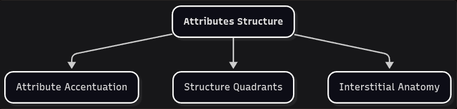

# Attribute Accentuation

*On heed and periphery.*

Attributes Structure is the stretch of EIC that builds toward Interstitial Anatomy. We get there by applying operators to the pairs of the primary jurisdiction. The first of those operators, used *inside* a pair, is **accentuation**.

- **ATTRIBUTES STRUCTURE**: EIC step that explores the interstitial anatomy components of Behavior Dynamics.

- **ATTRIBUTE ACCENTUATION**: Temporary focus on one member of an attribute pair, without dismissing the other side.

The Stillness–Movement pair begins in symmetry: **Stillness ≡ Movement**. A garden at rest and a garden at work are not two gardens. Focusing on the still one does not break that symmetry, so long as the working one is not dismissed. Accentuation marks the focus: **Stillness ← Movement**.

| **ACCENTUATION** | **SYMBOLIC FORM** |
|----|---|
| Stillness ← Movement = Pro-Stillness | Q ← M = pQ |
| Movement ← Stillness = Pro-Movement | M ← Q = pM |
| Simultaneity ← Successiveness = Pro-Simultaneity | Si ← Su = pSi |
| Successiveness ← Simultaneity = Pro-Successiveness | Su ← Si = pSu |

Using the full pair every time soon becomes impractical. Naming only "Stillness" is worse: the complement disappears from the page and, soon after, from the analysis. The "pro-" prefix keeps the pair in view: **Stillness ← Movement = Pro-Stillness**.

In EIC, "pro" does not imply preference, and it does not mean we are against the other side (there is no "Anti-Movement" here). Focusing on the still garden is not a vote against the working one. The other side remains available. The prefix is a concise tool for building further concepts while staying inside Attributes Regulation.

The form `Q ← M = pQ` will carry that focus into denser configurations. Next we join these accentuations to one another.
