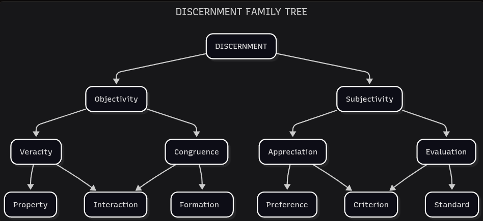

# Discernment

*On knowing.*

We reached the first EIC compartment that ties directly with everyday life. The reader is free to implement Interstitial Anatomy frameworks at their own discretion. Although, we encourage everyone to continue reading until the EIC synthesis is completed to maximize their utility. The following terminology explanation may seem a burden, but the reader is not required to remember the entire progression. The final set of concepts labeled **Discernment Children** is enough for practical use.

---

Interstitial discernment is a behavior performed by a member. This discernment can relate to that member's identity in different ways — either **bounded** (dependent on their perspective) or **non-bounded** (detached from their presence). We'll adapt this dynamic to more familiar terminology:

- **Non-bounded Discernment**: Objectivity
- **Bounded Discernment**: Subjectivity

Discernments can **assert** facts and perspectives on the world, or can **arrange** aspects of a phenomenon to enhance its comprehension. For these variations we also have practical terms:

- **Assertive Discernment**: Assertion
- **Arranging Discernment**: Arrangement

The previous four aspects heavily influence the way we discern the world. Therefore, we are going to establish them as **discernment ascendancies**. 

| **DISCERNMENT ASCENDANCY** | **Objectivity** | **Subjectivity** |
|---|---|---|
| **Assertion** | Veracity | Appreciation | 
| **Arrangement** | Congruence | Evaluation |

The intersection between ascendancies creates a set of four **discernment parentage**:
- Objective Assertion. 
- Objective Arrangement.
- Subjective Assertion.
- Subjective Arrangement.

This terminology might feel too abstract at first, so we also introduce more familiar names under the **discernment parent** label. Parents are not a different set from parentage, just a simpler way to name the ascendancies intersections.

| **DISCERNMENT PARENTAGE** | **DISCERNMENT PARENT** |
|---|---|
| Objective Assertion | Veracity |
| Objective Arrangement | Congruence |
| Subjective Assertion | Appreciation |
| Subjective Arrangement | Evaluation |

The last set of concepts (and the most relevant for practical use) is originated by the authority balance between discernment parents. Accordingly, we'll label them **discernment children**. And we'll use accentuation and concatenation operators to represent the parents' relationship in this way:
- **Accentuation**: One parent has more authority over the other.
- **Concatenation**: Both parents hold equal authority.

| **DISCERNMENT AUTHORITY** | **DISCERNMENT CHILD** |
|---|---|
| Veracity ← Congruence | Property |
| Congruence ← Veracity | Formation |
| Veracity ^ Congruence | Interaction |
| Appreciation ← Evaluation | Preference |
| Evaluation ← Appreciation | Standard |
| Appreciation ^ Evaluation | Criterion |

Now we can freely explore a systemic phenomenon under the discernment children framework. Each discernment child has its own jurisdiction, guided by its ascendancy. This allows us to expand our systemic awareness while maintaining internal coherence. You can examine the following **discernment family tree** for a better grasp of each concept under this section.

