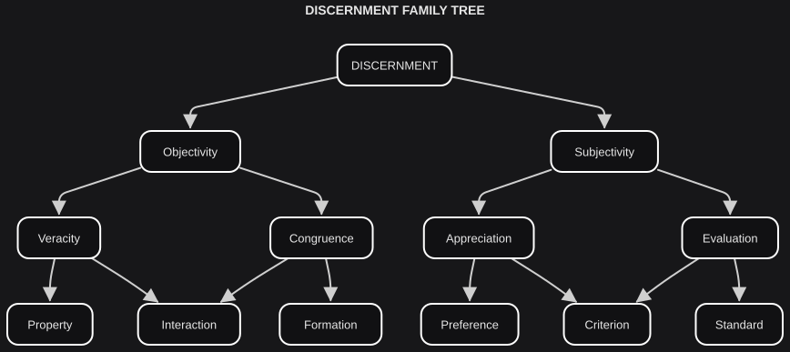

# Discernment

*On knowing.*

Discernment is a behavior performed by a member. It can relate to that member's identity in two ways: **bounded** (dependent on their perspective) or **non-bounded** (detached from their <plain>presence</plain>). In more familiar terms:

- **Non-bounded Discernment**: Objectivity
- **Bounded Discernment**: Subjectivity

A reading of a river's height from a gauge is non-bounded: it does not depend on who is looking. A reading of the same river as "our border" is bounded: it depends on the polities that claim it. Both are discernment. They are not the same cut.

Discernments can also **assert** facts and perspectives, or **arrange** aspects of a phenomenon so that it can be grasped:

- **Assertive Discernment**: Assertion
- **Arranging Discernment**: Arrangement

These four aspects heavily influence how we discern. We hold them as **discernment ascendancies**.

| **DISCERNMENT ASCENDANCY** | **Objectivity** | **Subjectivity** |
|---|---|---|
| **Assertion** | Veracity | Appreciation |
| **Arrangement** | Congruence | Evaluation |

The intersections of the ascendancies are the **discernment parentage** — Objective Assertion, Objective Arrangement, Subjective Assertion, Subjective Arrangement. **Discernment parents** are not a second set. They are the same intersections under shorter names.

| **DISCERNMENT PARENTAGE** | **DISCERNMENT PARENT** |
|---|---|
| Objective Assertion | Veracity |
| Objective Arrangement | Congruence |
| Subjective Assertion | Appreciation |
| Subjective Arrangement | Evaluation |

The working set — and the one most useful in practice — comes from the authority balance between parents. These are the **discernment children**. Accentuation means one parent has more authority; concatenation means both hold equal authority.

| **DISCERNMENT AUTHORITY** | **DISCERNMENT CHILD** |
|---|---|
| Veracity ← Congruence | Property |
| Congruence ← Veracity | Formation |
| Veracity ^ Congruence | Interaction |
| Appreciation ← Evaluation | Preference |
| Evaluation ← Appreciation | Standard |
| Appreciation ^ Evaluation | Criterion |

A lesion that is there even though it does not fit the model is a **property**: veracity has authority over congruence. A map that still organizes a noisy set of readings is a **formation**: congruence has authority over veracity. A finding that is both accurate and well-formed is an **interaction**. On the subjective side, "I want this mug" is a **preference**; "this is what counts as a mug here" is a **standard**; a jury's shared sense of what the case requires is a **criterion**.

Each child has its own jurisdiction, guided by its ascendancy. That is how the method can widen what we know without collapsing every reading into one. The **discernment family tree** holds the whole progression in view:

