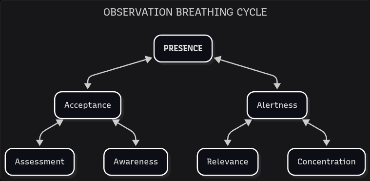

# Observation

*On insights.*

The next Interstitial Anatomy item has a similar beginning to the previous one. We can apply the same **bounded**/**non-bounded** aspects to Observation as a starting point.

- **Bounded Observation**: Judgement
- **Non-bounded Observation**: Attention

Our first concepts are **judgement** and **attention**, corresponding to bounded and non-bounded observation, respectively. When we judge something, we are attaching our own perspectives, priorities and biases to the act of observing. If we want to empty out this judgement, we need to attend to the world as if we are not the one that is performing the act.

The next categories are much simpler, and they don't need an additional concept to be more practical. An observation can be performed from a **top-down** or a **bottom-up** perspective. Both approaches complement each other: top-down observations tend to be planned and overarching, while bottom-up observations are usually spontaneous and specific. 

The following step combines each previous element to form concrete **observation forms**:

| **OBSERVATION FORMS** | **Judgement** | **Attention** |
|---|---|---|
| **Top-Down** | Assessment | Awareness |
| **Bottom-Up** | Relevance | Concentration |

When we reached a similar stage with Discernment, we propagated those concepts into separate discernment children. On this new quadrant, a different approach is needed. We'll intersect these observation forms into one condensed type named **Presence**.

**Assessment** is the ability to place ourselves as judges of the world, determining what is right or wrong, suitable or inconvenient. But we can also use **awareness** to contemplate the entire landscape without judgement. When we integrate assessment and awareness we encounter **acceptance** towards the world: the state of being capable of holistic attention and appropriate judgement. 

- Assessment ^ Awareness = Acceptance

The world is constantly expressing itself in multiple manifestations. We feel compelled to assign a **relevance** order to those manifestations, but we can also **concentrate** in one aspect of the world that is outside our immediate judgement. When we integrate relevance and concentration we develop **alertness**: the state of open concentration and available relevance.

- Relevance ^ Concentration = Alertness

With these integrated observation forms we are reconciling the limitations of the starting distinctions, but a last integration is needed. When we consolidate acceptance and alertness we arrive at **presence**: the state of fullness observation.

- Acceptance ^ Alertness = Presence

The state of presence is constantly being disrupted by inner and outer stimuli. So, instead of treating presence as a *final destination*, we can approach it as a *resting point* — a state we can always return to, and not to pressure ourselves to remain in perpetually. When presence is disrupted, we can allow our observation to drift away, or we can return our consciousness to the state of presence. Let's use an **observation breathing cycle** to represent this constant motion:

