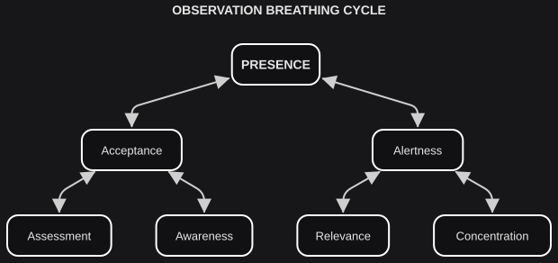

# Observation

*On insights.*

Observation can take the same **bounded** / **non-bounded** cut as discernment, but the job is different. The last chapter was a method of knowing. This one is a method of watching — and of noticing when the watch has already hardened into a verdict.

- **Bounded Observation**: Judgement
- **Non-bounded Observation**: Attention

When we judge, we attach our own perspectives, priorities, and biases to the act of observing. To empty that judgement out, we attend to the world as if we were not the one performing the act. A chair who has already decided what the vote means is judging. One who hears the next speaker as if the outcome were still open is attending. Both are observation.

An observation can also be **top-down** or **bottom-up**. The two complement each other: top-down tends to be planned and overarching; bottom-up, spontaneous and specific. These do not need extra names. Combined with judgement and attention they give four **observation forms**:

| **OBSERVATION FORMS** | **Judgement** | **Attention** |
|---|---|---|
| **Top-Down** | Assessment | Awareness |
| **Bottom-Up** | Relevance | Concentration |

Discernment, at a similar stage, branched into children. Observation does the opposite: it intersects the forms until they condense into one type, **Presence**.

**Assessment** places us as judges of the world — right or wrong, suitable or inconvenient. **Awareness** contemplates the landscape without that judgement. Integrate them and we get **acceptance**: holistic attention with judgement still available when it is needed.

- Assessment ^ Awareness = Acceptance

The world keeps offering more than we can hold. We feel compelled to assign a **relevance** <plain>order</plain> to its manifestations; we can also **concentrate** on one aspect outside our immediate judgement. Integrate them and we get **alertness**: open concentration, with relevance still available.

- Relevance ^ Concentration = Alertness

A last integration remains. Acceptance and alertness together are **presence**: the state of fullness observation.

- Acceptance ^ Alertness = Presence

Presence is constantly disrupted by inner and outer stimuli. It is not a final destination. It is a *resting point* — a state we can return to, not a state we are required to occupy without break. When it breaks, observation can drift, or we can come back. An **observation breathing cycle** is the right picture for that motion:

