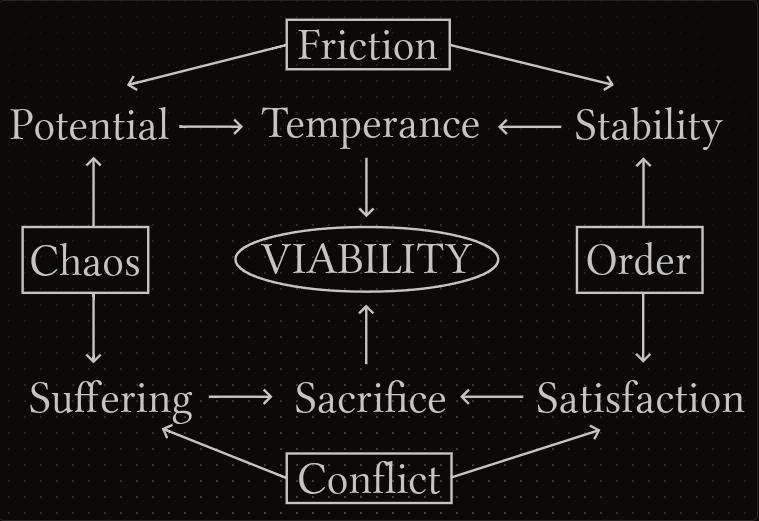
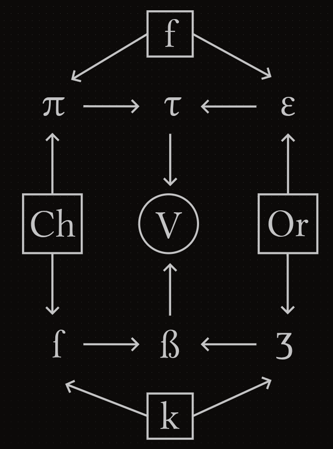

# Resolution

*On deciding.*

Next on our list is an EIC structure that tackles the way systemic challenges can be **resolved**. We'll begin by showing the final diagram with every Resolution component. As each concept is introduced, we encourage the reader to refer back to the diagram and observe how these elements interact.

The *squared corners* are our starting point. **Chaos** vs **Order** is a main duality in complex systems, and both elements create challenges for us to resolve. It’s worth noting that chaos does not imply wrongness, just as order does not necessarily imply rightness. The presence of both can be challenging depending on the context. The same is true for any following element discussed here.

The other main **challenge duality** is **friction** and **conflict**. They may seem too similar, but here we relate friction to structural challenges, and conflict to behavioral challenges. Both elements are present in challenging scenarios, and they intersect with chaos and order to form specific qualities. Let's start reviewing them from the top of the diagram:

| **INTERACTION** | **RESULT** |
|---|---|
| Friction ^ Chaos | Potential |
| Friction ^ Order | Stability |
| Conflict ^ Chaos | Suffering |
| Conflict ^ Order | Satisfaction |

Each of these pairings fight for our energy, demanding to be prioritized. It is unlikely that we can resolve a challenge by dismissing one over the other, so our goal we'll be to balance them instead. This balancing dynamic must reconcile each aspect according to the context, since no fixed proportion fits every challenge. 

| **INTERACTION** | **RESULT** |
|---|---|
| Potential ^ Stability | Temperance |
| Suffering ^ Satisfaction | Sacrifice |

**Temperance** is the engagement of our potential with a stable support. It allows us to explore the world without losing our foundations. **Sacrifice** is the conscious choice of accepting a present suffering to enjoy a future satisfaction. It allows us to combine our current priorities with tomorrow's needs to maximize the experience of each temporal version of ourselves. These integrations may take many forms, but we can summarize them like this:

- **Temperance**: forward-facing, dynamic regulation.
- **Sacrifice**: temporally-aware, delayed gratification.

Our final synthesis is the combination of temperance and sacrifice, giving rise to **viability**. At the end of the day, we must reconcile our interest, priorities and desires with the limitations of the world. And that entails an understanding of what is viable on each context, instead of blaming the world for its constant challenges. With a tempered and sacrificial mindset **we can endure** any adversity.

---

Before moving on, we offer a symbolic version of the main diagram and a table of references:

| **INTERACTIONS** | **SYMBOLIC REFERENCE** |
| --- | --- |
| Friction ^ Chaos = Potential | f ^ Ch = π |
| Friction ^ Order = Stability | f ^ Or = ε |
| Conflict ^ Chaos = Suffering | k ^ Ch = ſ |
| Conflict ^ Order = Satisfaction | k ^ Or = Ʒ |
| Potential ^ Stability = Temperance | π ^ ε = τ |
| Suffering ^ Satisfaction = Sacrifice | ſ ^ Ʒ = ẞ |
| Temperance ^ Sacrifice = Viability | τ ^ ẞ = V |

The reader may use both the textual and symbolic versions, or choose the one that helps them grasp these interactions better. Many symbols employed here are nods to two of the most influential philosophical traditions.

- The pi (π), epsilon (ε) and tau (τ) symbols are of course allusions to Greek philosophy and culture.
- The "long s" (ſ), "tailed z" (Ʒ) and eszett (ẞ) symbols are references to German philosophy and culture, being the letter ẞ usually associated with the German language. The long s and tailed z letters are the orthographical origins of the eszett. 