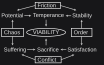
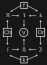

# Resolution

*On deciding.*

Resolution is the method of settling a systemic challenge. We begin with the full diagram. The pieces below are the same ones it already holds.

The squared corners are the starting dualities. **Chaos** and **Order** are a main pair in complex systems, and both create challenges. Chaos does not imply wrongness; order does not imply rightness. A riot and a freeze can both be unlivable. The same is true of every element that follows: none of them is a moral verdict on its own.

The other challenge duality is **friction** and **conflict**. They are easy to collapse. Here, friction is structural — a load that does not sit, a form that will not file, a joint that binds. Conflict is behavioral — members at odds. Both are present in a real challenge, and they concatenate with chaos and order:

| **INTERACTION** | **RESULT** |
|---|---|
| Friction ^ Chaos | Potential |
| Friction ^ Order | Stability |
| Conflict ^ Chaos | Suffering |
| Conflict ^ Order | Satisfaction |

Unused capacity in a disordered process is **potential**. A locked joint, a settled procedure, is **stability**. Conflict without a shape is **suffering**. Conflict that has found a shape — a verdict, a treaty, a scored piece — is **satisfaction**. Each pairing pulls for priority. Dismissing one to keep another is not a resolution. The work is to hold them in a proportion the situation can actually bear. No fixed ratio fits every challenge.

| **INTERACTION** | **RESULT** |
|---|---|
| Potential ^ Stability | Temperance |
| Suffering ^ Satisfaction | Sacrifice |

**Temperance** is potential with a stable support: exploring without losing the foundations. **Sacrifice** is the choice of a present suffering for a future satisfaction: this season's pruning for the next harvest. In short:

- **Temperance**: forward-facing, dynamic regulation.
- **Sacrifice**: temporally-aware, delayed gratification.

Their combination is **viability**. Interests, priorities, and desires have to be reconciled with what the world will actually carry. That is an understanding of what this context can bear. A tempered and sacrificial stance is how a challenge is lived through rather than merely named.

---

A symbolic version of the same diagram, and a table of references:

| **INTERACTIONS** | **SYMBOLIC REFERENCE** |
| --- | --- |
| Friction ^ Chaos = Potential | f ^ Ch = π |
| Friction ^ Order = Stability | f ^ Or = ε |
| Conflict ^ Chaos = Suffering | k ^ Ch = ſ |
| Conflict ^ Order = Satisfaction | k ^ Or = Ʒ |
| Potential ^ Stability = Temperance | π ^ ε = τ |
| Suffering ^ Satisfaction = Sacrifice | ſ ^ Ʒ = ẞ |
| Temperance ^ Sacrifice = Viability | τ ^ ẞ = V |

The two versions are the same structure in two representation types. Many of the symbols nod to two philosophical traditions: pi (π), epsilon (ε), and tau (τ) toward Greek; long s (ſ), tailed z (Ʒ), and eszett (ẞ) toward German — the long s and tailed z being the orthographical origins of the eszett.
