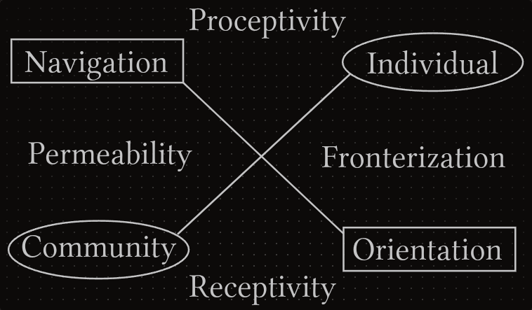

# Operation

*On actions.*

Our last item in Instertitial Anatomy has a special backstory. The next concepts were the first that the author managed to organized as a proper set. They are the stepping stone for Conciliatorics, created long before there was a name for this project. When this item was synthesized, the rest of the concepts began falling into place. What we now refer to as the **Operation** aspect of interstitial anatomy, before it was called the **Compass**.

This name comes from the shape of the diagram that represents these concepts, but also for their utility. The EIC compass enhances our flight in the systemic winds, and assigns a cardinal direction for each operation mode.

Let's introduce the diagram and discuss its components.

The root levels are the horizontal **Identity Axis** and the vertical **Participation Axis**. Our identity is elastic; it may seem as rock solid to us at any given point, but it was developed by the influence of our experiences. The identity **fronterization** gives boundaries to our sense of self, while the identity **permeability** allows us to adapt to the world's flow. 

We usually associate the notion of participation with active engagement. But in order to engage accurately, we must first be receptive to our environment. **Proceptivity** and **receptivity** engage back and forth to calibrate our participation in a complex system. In many contexts you see these qualities describe as *masculine* and *feminine*. While that framework is valid, we really enjoy the *proceptive* and *receptive* participation scheme; it encourages a neutral tone and allows a greater conceptual development.

We have now a set of four simple cardinal directions:

- **North**: Proceptivity (Pr)
- **South**: Receptivity (Re)
- **East**: Fronterization (Fr)
- **West**: Permeability (Pe)

From these cardinal points we can expand our compass to cover more complex systemic operations. Combining fronterization and proceptivity we get the **individual** (i) hemisphere. Individuality ties to a defined entity exerting itself into the world. This contrasts with the **community** (c) hemisphere, which entails being permeable and receptive. Therefore, our communal participation aspect is located at the south-west direction.

**Orientation** (o) sharpens as we become more attuned to environmental input, while also refining our intentions. So it follows that this hemisphere is placed at the south-east. But despite being properly oriented we need to eventually jump into the world by being proceptive in our **navigation** (n) and permeable to the unexpected. With this last hemisphere located at the north-west direction we complete our operational compass.

The operation diagram is much simpler that the previous one. So, not only we'll also share a symbolic version, but we encourage that the reader tries to engage with it. The cardinal points initials (N, S, E and W) blend well with our own compass symbols (Pr, Re, Fr and Pe). Eventually, they'll become intertwined and enhance their assimilation.

| **OPERATION AREA** | **INTERACTION** |
|---|---|
| Horizontal Axis | **Identity** = Permeability ^ Fronterization |
| Vertical Axis | **Participation** = Proceptivity ^ Receptivity |
| North-East Hemisphere | **Individual** = Proceptivity ^ Fronterization |
| South-West Hemisphere | **Community** = Receptivity ^ Permeability |
| South-East Hemisphere | **Orientation** = Receptivity ^ Fronterization |
| North-West Hemisphere | **Navigation** = Proceptivity ^ Permeability |

With this we conclude the last interstitial anatomy component. We hope that you found these conceptual structures helpful so far. But now our framework needs to **become alive**. As we know, the anatomy of a biological system may be interesting, but is its **physiology** that raises the highest wonder.
