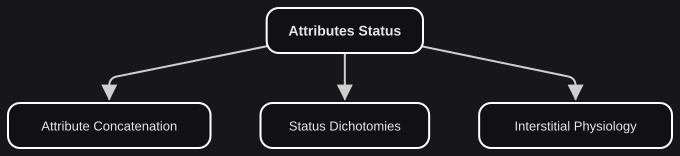

# Attribute Concatenation

*On crossing the bridge.*

Anatomy is a structure. Status is where that structure starts to live.

- **ATTRIBUTES STATUS**: EIC step that studies the interstitial physiology processes of Behavior Dynamics.

As in Attributes Structure, we apply operators to the primary pairs. This time the operator is not accentuation *inside* a pair. It is concatenation *between* attributes of different pairs.

- **ATTRIBUTE CONCATENATION**: Crossed <plain>interaction</plain> between attribute pairs from the primary jurisdiction.

| **ATTRIBUTE CONCATENATION** | **SYMBOLIC REPRESENTATION** |
| --- | --- |
| Stillness ^ Simultaneity = Consistency | Q ^ Si = C |
| Movement ^ Successiveness = Impermanence | M ^ Su = I |
| Stillness ^ Successiveness = Balance | Q ^ Su = B |
| Movement ^ Simultaneity = Imbalance | M ^ Si = b |

The result is not four equal capacities, each an "enhanced" version of a primary (Stillness → Pro-Stillness). It is two new pairs, of two different kinds:

- Consistency / Impermanence
- Balance / Imbalance

The first pair **reinforces**. Successive motion leads to **Impermanence**; simultaneous serenity leads to **Consistency**. A held tone, a law in force at noon and at midnight, a stone that is still *now*: consistency. A fever's course, a price series, a river: impermanence. These qualities attach themselves spontaneously, but the pairing is far less stable than anything in the primary jurisdiction. Accentuating one side here is more violent. It has a greater risk of breaking the pair.

The second pair **cancels**. That is why its members are **interstitial statuses** rather than identifiable qualities. A **balanced** state depends on remaining still through the passage of time — a fallow field, a gyroscope, a clause that is not rewritten every week. **Imbalance** is simultaneous elements moving differently: two agencies on the same file, an ensemble out of time, many hands on one bed each working a different motion. Balance does not mean superiority. There are contexts that need imbalance.

With these two pairs in place, their further <plain>interactions</plain> will produce a higher — and less stable — interstitial complexity.
