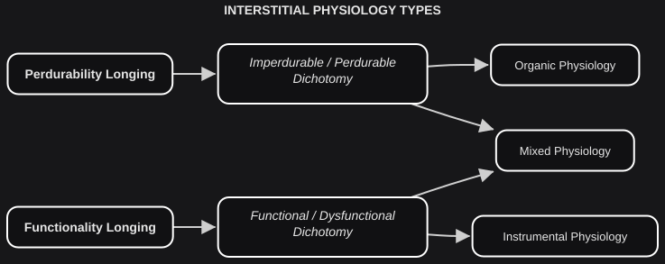

# Interstitial Physiology

*On sticks, stones and bones.*

Most complex systems are either *biological* or *artificial*. Biological systems — from microbes to intelligent animals — evolved with a survival drive: a **perdurability longing**. Artificial systems — from basic tools to advanced A.I. — are built with a performance ambition: a **functionality longing**. The <plain>interaction</plain> of those longings with the status dichotomies is **Interstitial Physiology**.

This is the first time in EIC that a theoretical structure meets a drive. Each longing, on its own, can be coherent.

- **INTERSTITIAL PHYSIOLOGY**: Set of <plain>interactions</plain> between interstitial longings and status dichotomies.

- The <plain>interaction</plain> between the **perdurability longing** and the Imperdurability / Perdurability dichotomy is **Organic Physiology**.
- The <plain>interaction</plain> between the **functionality longing** and the Functional / Dysfunctional dichotomy is **Instrumental Physiology**.

Each type is self-contained. It has no access to the other dichotomy:

- Organic Physiology lacks the Functional / Dysfunctional dichotomy.
- Instrumental Physiology lacks the Imperdurability / Perdurability dichotomy.

A body is not trying to be a good instrument. A hammer is not trying to survive as a species. That is not a defect in either physiology. It is the boundary that keeps each one honest.

These <plain>interactions</plain> are also of a new kind. The longings *modulate* their dichotomies: they alter the internal dynamic, rather than heightening a side or combining two terms. Accentuation and concatenation cannot mark that. **Modulation** (`→`) can.

| **INTERSTITIAL ELEMENT** | **SYMBOLIC REPRESENTATION** |
|---|---|
| Imperdurability / Perdurability Dichotomy | I≡ ^ I≢ |
| Functional / Dysfunctional Dichotomy | C≡ ^ C≢ |
| Perdurability Longing | I≢L |
| Functionality Longing | C≡L |
| Organic Physiology | oP = I≢L → (I≡ ^ I≢) |
| Instrumental Physiology | iP = C≡L → (C≡ ^ C≢) |

**Symbolic Note**: The longing symbols inherit their anchor from the value most associated with their origin: `I≢` (perdurability) and `C≡` (functionality). The subscript "L" marks them as motivational rather than structural.

Most complex systems are one or the other. Some long equally for both. **Humanity** is the nearest case we have; nothing in the model forbids others — a human–A.I. integration, a species we have not met. That simultaneous longing is **Mixed Physiology**.

| **PHYSIOLOGY TYPES** | **SYMBOLIC REPRESENTATION** |
|---|---|
| Organic Physiology | oP = I≢L → (I≡ ^ I≢) |
| Instrumental Physiology | iP = C≡L → (C≡ ^ C≢) |
| Mixed Physiology | mP = [I≢L → (I≡ ^ I≢)] ^ [C≡L → (C≡ ^ C≢)] |
| Mixed Physiology (short form) | mP = oP ^ iP |

The **principle of self-defense** is a rare case in which the two longings have been roughly integrated. As biological systems we are compelled to preserve our existence. In theory we could kill every other human who might threaten it — in line with the perdurability longing. We are also collectively aware that indiscriminate killing is dysfunctional — not in line with the functionality longing. Most human societies have agreed that force may be used to preserve a life, and only as self-defense: preservation has to remain congruent with a functional ethic.

Self-defense is widely shared. The same integration is not true of the vast majority of humanity's endeavors. The next section is why.
