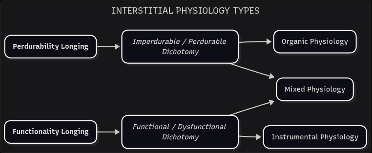

# Interstitial Physiology

*On sticks, stones and bones.*

Most complex systems are either *biological* or *artificial* in nature. Biological systems (from microbes to intelligent animals) evolved with a survival drive, which we'll call a **perdurability longing**. Artificial systems (from basic tools to advanced A.I.) are constructed with a performance ambition, which we'll call a **functionality longing**. The interaction between these longings and the previous interstitial dichotomies creates a special kind of structure, contained under the label of **Interstitial Physiology**. 

This is the first time in our EIC journey that theoretical concepts interact directly with behavioral realities. Therefore, these structures carry more expansive and sophisticated implications. 

- The interaction between the **perdurability longing** and the **Imperdurability / Perdurability dichotomy** is contained in the **Organic Physiology**. 
- The interaction between the **functionality longing** and the **Functional / Dysfunctional dichotomy** is contained in the **Instrumental Physiology**.

These physiology types are self-contained—meaning they don't have access to the elements of the opposite dichotomy:

- Organic Physiology lacks access to the Functional / Dysfunctional dichotomy.
- Instrumental Physiology lacks access to the Imperdurability / Perdurability dichotomy.

Additionally, these interactions are unlike the previous ones. Both longings *modulate* their respective dichotomies, disrupting their behavior. This interaction quality is foreign to accentuations and concatenations. So, we can use the last operator of our original set: **Modulation** (→). Unlike accentuation or concatenation—which heighten or combine attributes—modulation actively alters the internal dynamic of an interstitial element.

| **INTERSTITIAL ELEMENT** | **SYMBOLIC REPRESENTATION** |
|---|---|
| Imperdurability / Perdurability Dichotomy | I≡ ^ I≢ |
| Functional / Dysfunctional Dichotomy | C≡ ^ C≢ |
| Perdurability Longing | I≢L |
| Functionality Longing | C≡L |
| Organic Physiology | oP = I≢L → (I≡ ^ I≢) |
| Instrumental Physiology | iP = C≡L → (C≡ ^ C≢) |

**Symbolic Note**: The longing symbols inherit their anchor from the value most associated with their systemic origin: `I≢` (perdurability) and `C≡` (functionality). The subscript "L" distinguishes them as motivational rather than structural elements.

While the vast majority of complex systems are either biological or artificial, there is the possibility of a system that longs equally for functionality and perdurability. **Humanity** is our most proximal example, but of course there is potential for any amount of other systems like this: Humanity + A.I. futuristic integration, unknown extraterrestrial species, etc. This simultaneous longing is contained in the **Mixed Physiology**.

| **PHYSIOLOGY TYPES** | **SYMBOLIC REPRESENTATION** |
|---|---|
| Organic Physiology | oP = I≢L → (I≡ ^ I≢) |
| Instrumental Physiology | iP = C≡L → (C≡ ^ C≢) |
| Mixed Physiology | mP = [I≢L → (I≡ ^ I≢)] ^ [C≡L → (C≡ ^ C≢)] |
| Mixed Physiology (short form) | mP = oP ^ iP |

We'll use the **principle of self-defense** to illustrate how these longings may integrate. As biological systems, we are compelled to take action in order to preserve our existence. In theory, we could kill every other human that could pose a threat to our lives—that will be **in line** with our perdurability longing. But we are collectively aware enough that this indiscriminate killing will be dysfunctional—therefore, **not in line** with our functionality longing. So, most human societies agreed that is ok to use force to preserve our own life, but only as an act of self-defense—our methods of preservation must remain congruent with functional ethics and moral behavior.

While the self-defense principle is mostly universally agreed, the same is not true for the vast majority of humanity's endeavors. We'll see why this is the case in the next section.

