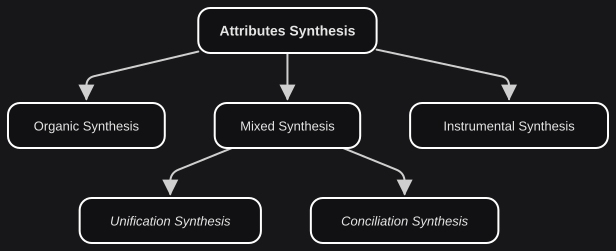

# Anatomy and Physiology Integration

*On unending crossroads.*

We now integrate Interstitial Anatomy and Interstitial Physiology. The road from Attributes Dynamics to this point has been conceptual: a map of how complex systems are structured and how they live. Attributes Synthesis is not an endpoint. It is the outermost layer of interstitiality, built on every layer beneath it.

- **ATTRIBUTES SYNTHESIS**: EIC step that integrates the exploration of attributes structure and status.

The synthesis types — Organic, Instrumental, and Mixed — are the physiological modes already named. Here they show how a system integrates structure and function: physiology animating anatomy. We could have labeled these by the anatomy methods instead. Sorting them by physiology is the more intuitive cut, and it is the one that lets Mixed Synthesis split — a bifurcation we will reach once the simpler two are in place.
