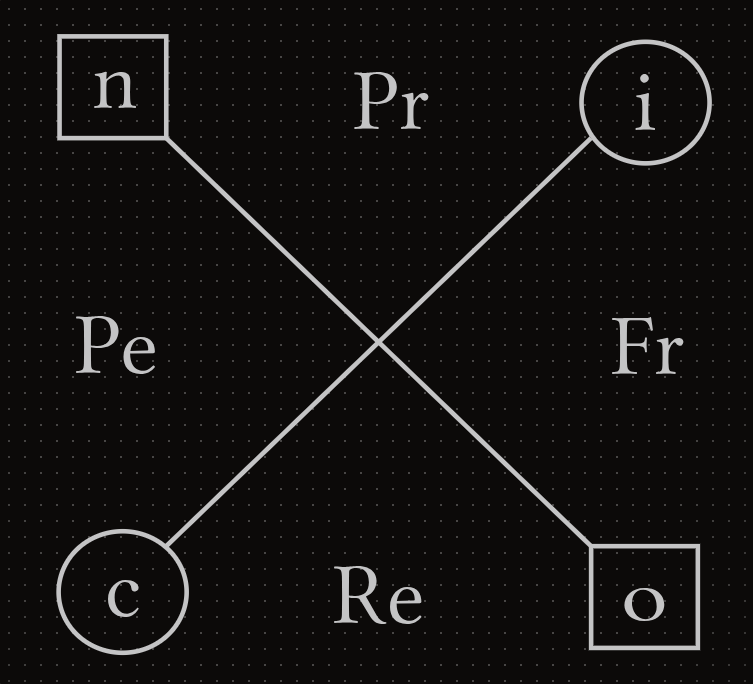

# Operational Status

*On the sea and the compass*

We developed the main structure of EIC, making sure that each concept is integrated with the rest. But this is just the groundwork of this parcel. Each area needs to be expanded to become more useful and effective to analyze the world. Before moving on to the next parcel we want to present an example of this pending development: the first developed Edge EIC concept (see Core EIC and Edge EIC).

The name is not a coincidence. **Operational Status** is the deliberate combination of *Operation* (from Attributes Structure) and the functional/dysfunctional framing of *Status* (from Attributes Status) — the Operation compass, considered as something that can be exercised in a functional or dysfunctional way rather than as a fixed set of four directions.

First, let's refresh the four cardinal directions of the Operation quadrant from Interstitial Anatomy:

- **North**: Proceptivity (Pr)
- **South**: Receptivity (Re)
- **East**: Fronterization (Fr)
- **West**: Permeability (Pe)

Different members in a system will implement these operational actions in their own way. Sometimes they will accentuate one direction over its complementary. And if there is an excessive emphasis on a specific direction, it can devolve from a complementary relationship to an oppositional one. So, how can we represent these variations in a clear and effective way? For this case, we'll use two sets of modulators:

- To show a functional accentuation variation that maintains complementarity between Operation components: Sub / Supra (s / S)
- To show a dysfunctional accentuation variation that breaks complementarity between Operation components: Hypo / Hyper (h / H)

| **Operation Modulator** | **Symbol** |
|---|---|
| Sub | s |
| Supra | S |
| Hypo | h |
| Hyper | H |

Let's take a predator/pray dynamic from a typical ecological system. Both the predator and prey need to operate in the world with proceptivity and receptivity regarding other systemic components. But in relation to each other, the predator needs to be much more proactive when looking for their food source. In exchange, the prey needs to be much more receptive of their surroundings to avoid becoming dinner. And this emphasis comes with the trade-off of being less receptive for the former, and less proactive for the latter. We can use the first set of modulators to show these dynamics:

- Predator: Supra-proceptive (SPr) / Sub-receptive (sRe)
- Prey: Supra-receptive (SRe) / Sub-proceptive (sPr)

For the second set, we can describe two dysfunctional states of the gut epithelium (or mucosal barrier). The gut lining must selectively absorb nutrients while blocking pathogens and toxins. When tight junctions between epithelial cells break down, foreign antigens, un-digested proteins, and bacterial endotoxins leak directly into the bloodstream, triggering systemic autoimmune responses and chronic inflammation.

Conversely, if the intestinal epithelium becomes overly thick, fibrotic, or structurally compromised (as seen in severe mucosal atrophy, intestinal fibrosis, or unmanaged celiac disease), it becomes too closed off from the lumen. It fails to absorb essential vitamins, minerals, and macronutrients the body needs to survive, leading to severe malnutrition despite adequate dietary intake.

- Increased Intestinal Permeability ("Leaky gut"): Hyper-permeability (HPe) / Hypo-fronterization (hFr)
- Nutrient Isolation (Malabsorption): Hyper-fronterization (HFr) / Hypo-permeability (hPe)

These labels describe the **Operational Status** of a member or a system. Here's the full list:

| **Operation Status** | Receptivity | Proceptivity | Fronterization | Permeability |
|---|---|---|---|---|
| Sub | Sub-receptivity (sRe) | Sub-proceptivity (sPr) | Sub-fronterization (sFr) | Sub-permeability (sPe) |
| Supra | Supra-receptivity (SRe) | Supra-proceptivity (SPr) | Supra-fronterization (SFr) | Supra-permeability (SPe) |
| Hypo | Hypo-receptivity (hRe) | Hypo-proceptivity (hPr) | Hypo-fronterization (hFr) | Hypo-permeability (hPe) |
| Hyper | Hyper-receptivity (HRe) | Hyper-proceptivity (HPr) | Hyper-fronterization (HFr) | Hyper-permeability (HPe) |

The Operation/Status combination holds at the operator level too. Sub and Supra describe a *functional* accentuation — one that stays complementary with its pair, the same way Symmetry (`≡`) marks an available status. Hypo and Hyper describe a *dysfunctional* accentuation — one whose emphasis has broken complementarity with its pair, the same way Asymmetry (`≢`) marks a detrimental status. Hypo and Hyper are not an "Anti-" framing of the kind Attribute Accentuation deliberately avoided: they don't mean we are against a direction, only that its current accentuation, relative to its pair, has become dysfunctional.

If you have a situation where both components of an operation hemisphere have the same status, you may use the correspondent modulator attached to that hemisphere (e.g., Sub-proceptivity + Sub-fronterization = Sub-individual). But because this concurrency is very situational, it's still advised to name the internal directions alongside the modulated hemisphere to avoid terminology confusions. 

As you can see, Operational Status has a lot of potential to analyze both specific systems with different status and different systems under specific status. We'll focus on the development of this EIC method in the future. At this moment of our conversation of Conciliatorics, we need to re-integrate what we discussed so far with the root concepts. Therefore, we'll shift our focus over a new parcel: Edified Intrinsic Transformation.