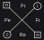

# Operational Status

*On the sea and the compass*

Core EIC is groundwork. Each area of it can still be expanded until it is more useful for reading the world. Before we leave this parcel, one such expansion: the first developed Edge EIC concept.

The name is not a coincidence. **Operational Status** is Operation (from Attributes Structure) under the functional / dysfunctional framing of Status (from Attributes Status) — the compass, treated as something that can be exercised well or badly, rather than as four fixed directions.

- **OPERATIONAL STATUS**: Functional/dysfunctional gradation, via Sub/Supra/Hypo/Hyper modulators, applied to the Operation compass's four cardinal directions.

The cardinals, as already set:

- **North**: Proceptivity (Pr)
- **South**: Receptivity (Re)
- **East**: Fronterization (Fr)
- **West**: Permeability (Pe)

Members accentuate one direction over its complement. Taken too far, that emphasis stops being complementary and becomes oppositional. Two sets of modulators mark the difference:

- Functional accentuation, complementarity kept: Sub / Supra (`s` / `S`)
- Dysfunctional accentuation, complementarity broken: Hypo / Hyper (`h` / `H`)

| **Operation Modulator** | **Symbol** |
|---|---|
| Sub | s |
| Supra | S |
| Hypo | h |
| Hyper | H |

Upper case `S` here is a prefix. It is not the core `S` of Behavior Dynamics in `(cS)` or `[Cs]`. Position inside the expression is what disambiguates them.

A predator/prey pairing shows the functional set. Both still need proceptivity and receptivity toward the rest of the system. Relative to each other, the predator has to be more proactive in the hunt, the prey more receptive to what is coming. The trade-off is real: the hunter is less receptive, the hunted less proactive.

- Predator: Supra-proceptive (SPr) / Sub-receptive (sRe)
- Prey: Supra-receptive (SRe) / Sub-proceptive (sPr)

The dysfunctional set can be read on the gut epithelium. The lining has to absorb nutrients and block pathogens. When tight junctions fail, antigens and toxins leak into the blood — hyper-permeability, hypo-fronterization. When the lining becomes too thick, fibrotic, or closed (as in severe atrophy, fibrosis, or unmanaged celiac disease), it fails to absorb what the body needs, even when the diet is adequate — hyper-fronterization, hypo-permeability.

- Increased Intestinal Permeability ("Leaky gut"): Hyper-permeability (HPe) / Hypo-fronterization (hFr)
- Nutrient Isolation (Malabsorption): Hyper-fronterization (HFr) / Hypo-permeability (hPe)

The full grid:

| **Operation Status** | Receptivity | Proceptivity | Fronterization | Permeability |
|---|---|---|---|---|
| Sub | Sub-receptivity (sRe) | Sub-proceptivity (sPr) | Sub-fronterization (sFr) | Sub-permeability (sPe) |
| Supra | Supra-receptivity (SRe) | Supra-proceptivity (SPr) | Supra-fronterization (SFr) | Supra-permeability (SPe) |
| Hypo | Hypo-receptivity (hRe) | Hypo-proceptivity (hPr) | Hypo-fronterization (hFr) | Hypo-permeability (hPe) |
| Hyper | Hyper-receptivity (HRe) | Hyper-proceptivity (HPr) | Hyper-fronterization (HFr) | Hyper-permeability (HPe) |

At the operator level, Sub and Supra are a *functional* accentuation — complementarity kept, as Symmetry (`≡`) marks an available status. Hypo and Hyper are a *dysfunctional* accentuation — complementarity broken, as Asymmetry (`≢`) marks a detrimental status. They are not an "Anti-" framing. Attribute Accentuation refused that for a reason: we are not against a direction. We are marking that its current degree, relative to its pair, has become dysfunctional.

If both directions of a hemisphere share a status, the modulator can attach to the hemisphere (Sub-proceptivity + Sub-fronterization = Sub-individual). That concurrency is situational. Naming the inner directions alongside the hemisphere remains the safer habit.

Operational Status can read one system across statuses, or many systems under one status. That work continues. For now the treatise turns to a new parcel, so that what EIC has built is not only tested against invented examples: **Edified Intrinsic Transformation**.
